Villagers you hire, or take in chains, come and live at your base. Give one a bed and a
**Work Post** and it cuts your trees, farms your fields, cooks your meals or smiths your
gear, and puts everything it makes away in your chests. They eat, they shop at your stalls,
and when a raid comes they arm themselves from your chests and fight.

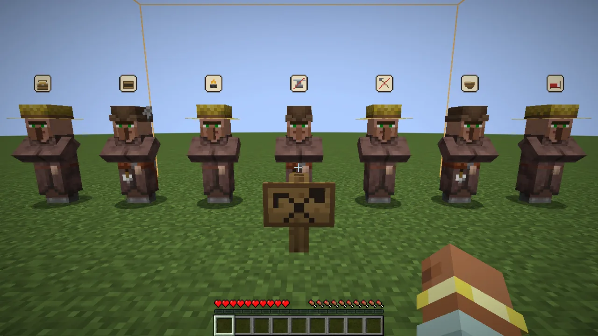

## Quick start

1. **Hire someone.** Sneak and right-click a villager that has a trade, with an empty hand.
   Click the green **[Hire for N emeralds]** line that appears in chat.
2. **Give it a bed.** Sneak and right-click your worker to open its **Worker Screen**, click
   **Assign bed**, then right-click a free bed within 30 seconds.
3. **Make a Work Post** (a fence and a sign, shapeless) and place it where the work is.
   Right-click it and pick a **job**: Woodcutting, Farming, Cooking or Blacksmith.
4. **Give it the job.** In the Worker Screen click **Assign job**, then right-click the post.
5. **Put a chest near the post** with the job's tool in it: an axe for woodcutting, a hoe
   for farming.

That's it: from the morning it works its shift and fills your chests.

## Hiring

- Sneak and right-click a villager that has a trade, **empty-handed**. A green
  **[Hire for N emeralds]** line appears in chat; click it within 30 seconds.
- The price is **8 emeralds per level**: a novice costs 8, a master 40. It comes out of
  everything you carry, backpacks included, and goes into the villager's purse.
- Villagers without a trade, nitwits and children can't be hired.
- In a village someone bought with Village Deed, only the owner and the players they trust
  can hire.
- With an emerald in your hand, sneaking and right-clicking is still Thief's gift, not a hire.

A hired villager with no bed follows you on foot. For a long trip, put it on the
[chain lead](#the-chain-lead).

### The Worker Screen

Sneak and right-click your own worker. A plain right-click still opens its trades.

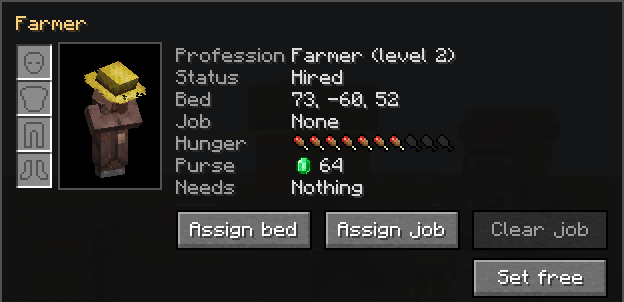

It shows the worker in its four gear slots, its profession and level, its bed, its job, its
hunger (ten drumsticks), its purse, and what it needs. The buttons:

| Button | What it does |
|---|---|
| **Assign bed** | Right-click a free bed within 30 seconds. The worker sleeps there from dusk, and no other villager takes it. |
| **Assign job** | Right-click a Work Post within 30 seconds. It must be yours, within 48 blocks of the bed, with fewer than four workers. Greyed out until the worker has a bed. |
| **Clear job** | The worker goes back to an ordinary villager's day at your base. |
| **Set free** | Click twice. It walks off to the nearest village. Its chain comes back to you; its tool and everything it wears drop where it stands. |

Its trades restock at its post, at most twice a day, the way a villager's do at its
workstation.

## The Work Post and the jobs

The **Work Post** is a fence and a sign, shapeless. Right-click it to set:

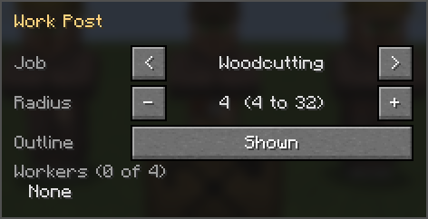

- **Job:** Woodcutting, Farming, Cooking or Blacksmith.
- **Radius:** the area is a cube around the post. Woodcutting 4 to 32 blocks (16 to start);
  the others 4 to 16 (8 to start).
- **Outline:** shows the area.
- **Stock list** (cooking and blacksmith): what to keep in the chests. See
  [the cook and the blacksmith](#the-cook-and-the-blacksmith).

Every chest, barrel or shulker box in the area is the post's storage. Up to four workers
share a post, and farming posts whose areas touch share a farm (see
[Shared farms](#shared-farms)). Breaking the post sends its workers back to an ordinary day.

### Woodcutting (needs an axe)

The worker fells the nearest **natural** tree whose trunk stands in the area: the whole tree,
top first, 2×2 trees too. It clears the leaves, collects the drops and replants saplings. It
leaves alone anything a player placed, and log pillars with no leaves on them, like a village
house's frame. Two woodcutters on one post fell two different trees.

### Farming (needs a hoe)

The worker harvests ripe crops on farmland and replants each from its own harvest. It also
takes pumpkins and melons, picks Farmer's Delight tomatoes and cuts ripe rice, and it sows bare
farmland (see [Sowing](#sowing)). It never tills new ground.

### Shared farms

Want a bigger farm? **Place more farming posts so their outlines touch.** Your posts whose areas
touch or overlap become one farm. There's nothing to click.

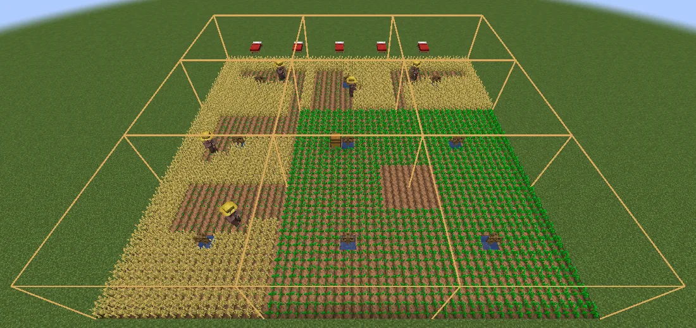

- Each post keeps its own radius, chests and four workers. A post with no workers is just more
  field. Nine posts at radius 16 cover a 99 by 99 field.
- The field is cut into 8 by 8 plots. Each farmer works one plot at a time, and no two farmers
  ever work the same plot.
- A farmer works **its own post's area first**, then helps anywhere on the farm.
- **They fill in for each other.** When a farmer dies, goes off to eat, defends a raid or ends its
  day, its plot is free at once for the next farmer. If it just vanishes (its chunk unloads), the
  plot frees itself after ten seconds.
- A farmer drops its harvest in the **nearest post's chests** on the farm. Put chests at one post
  only to make it the farm's barn.
- The post's screen shows how big the farm is:

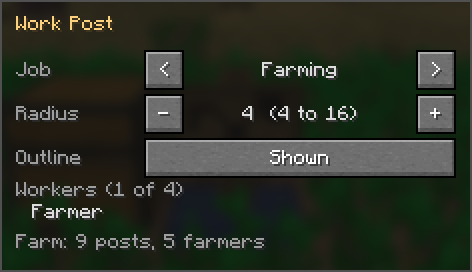

### Sowing

Farmers sow bare farmland, **without overriding what you planted**:

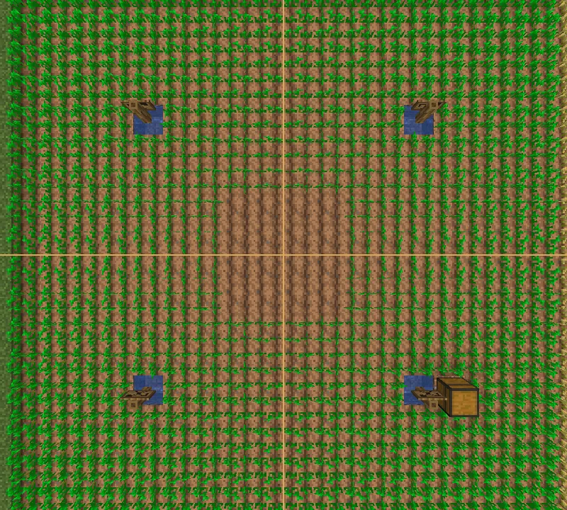

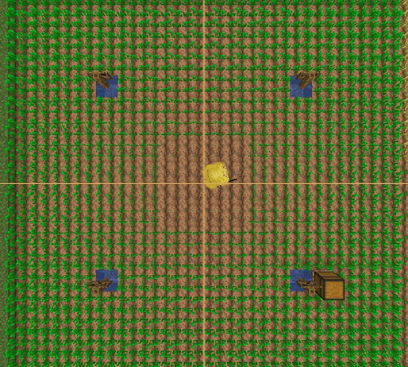

1. A spot that has grown a crop only ever gets that crop again. Plant a carrot in a wheat field
   and that spot stays a carrot spot.
2. Farmland that has never grown anything copies its neighbours **only when they all agree**:
   every crop within 4 blocks has to be the same kind. Where two crops meet, it's left for you.
3. So **plant one and they spread it.** Till a field, plant a few wheat, and the farmers fill it
   in. To keep a new patch for carrots, plant a carrot in it first.
4. They wait **a minute** before sowing a bare spot, so your own planting always comes first.
5. They never copy melon or pumpkin stems, and leave the ground near a stem bare for its fruit.

Seed comes from what the farmer carries, then from the farm's chests.

### Tools, speed and storage

- The worker takes its tool from the post's chests and wears it out as you would. When it
  breaks, it takes the next.
- It works at a player's speed with the same tool. A worker whose trade fits the job works
  **25% faster**: farmers at farming, the woodworker (or the fletcher) at woodcutting, butchers
  at cooking, and armorers, toolsmiths and weaponsmiths at the blacksmith's.
- It carries eight stacks, and puts them away when full and at the end of its shift: into a
  chest that already holds that item, else the chest whose items are most alike (seeds with
  seeds, logs with logs), else the chest nearest the post.

### The worker's day

| Time | What it does |
|---|---|
| 0–2000 | Free time (breakfast) |
| 2000–8000 | Works at its post |
| 8000–10000 | Meets at a bell, or goes shopping |
| 10000–12000 | Free time (dinner) |
| 12000 to dawn | Sleeps in its bed |

Workers open doors and fence gates on their way, and close them behind them.

### What the icons mean

When a worker lacks something, an icon floats over its head (you see it within eight blocks):

| Icon | Meaning |
|---|---|
| A bed | It has no bed. |
| An empty bowl | It's hungry. |
| A struck-out axe | No tool for its job in the post's chests (or no knife, for a cook). |
| A struck-out anvil | No station in the area makes what the stock list wants. |
| A flame over coal | No fuel. |
| An empty crate | The chests are short of what the stock list needs, or a farmer has nothing left to do but sow and no seed. |
| A full chest | Nothing it carries has anywhere to go. |

Work starts again by itself once the need is met.

## The cook and the blacksmith

These two keep the post's **stock list** filled. Right-click the post, then **Stock list...**

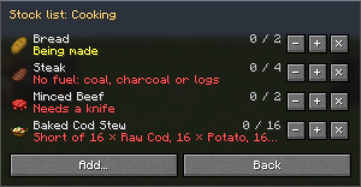

- Up to nine rows of "keep N of X", N from 1 to 999. The order is their priority.
- **Add...** opens a picker of everything the job's stations can make, with a search box.
- Each row says whether it is **stocked**, **being made**, or why it's stuck: what it's short of
  ("Short of 2 × Iron Ingot"), the station it needs, no fuel, or no knife.
- `−` and `+` change the number (by ten with shift); `×` drops the row.

The worker makes whatever the rows lack, and first whatever *that* needs, from what's in the
post's chests: for two iron pickaxes it smelts the raw iron, cuts planks into sticks, then
crafts. A row never uses up what another row keeps.

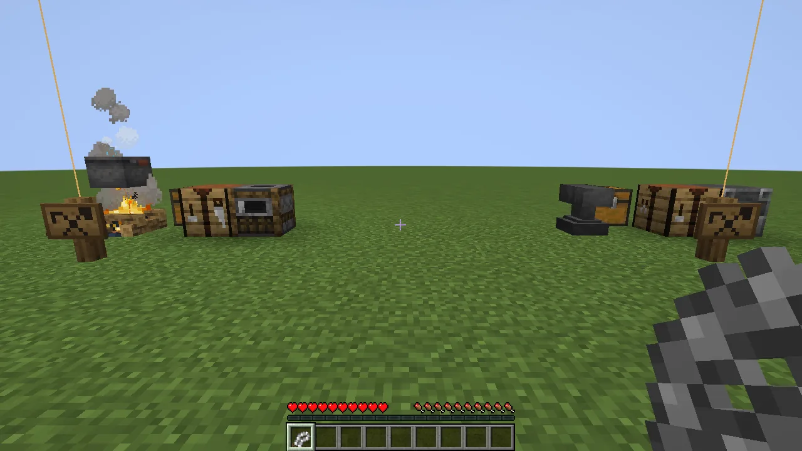

| Job | Stations it uses | Besides the list |
|---|---|---|
| Cooking | crafting table, furnace, smoker, campfire or Farmer's Delight stove, Farmer's Delight cooking pot and cutting board | makes charcoal when fuel runs low |
| Blacksmith | crafting table, furnace, blast furnace, smithing table, anvil, the weapons workbench | makes charcoal, smelts raw metal into ingots, mends worn gear |

- **Your stations stay yours:** a worker only uses an empty station, so a furnace you're using
  is left alone.
- **Fuel** comes from the chests (coal, charcoal, coal blocks). When they run low, logs become
  charcoal.
- **Repairs:** the blacksmith mends worn gear left in its chests at an anvil, with the gear's
  own material, using no XP.
- **Nothing gets melted down:** swords and armour are never smelted into nuggets.
- The cutting board needs a knife, which the cook fetches from the chests.
- The cook's chests are the **canteen**: workers whose home chest is empty eat from them.

## The chain lead

The **chain lead** (a lead and a chain, shapeless) is a set of cuffs. A villager in chains
doesn't work, trade, wander or run off. It goes where whoever holds its chain leads it, and
stands still when nobody does.

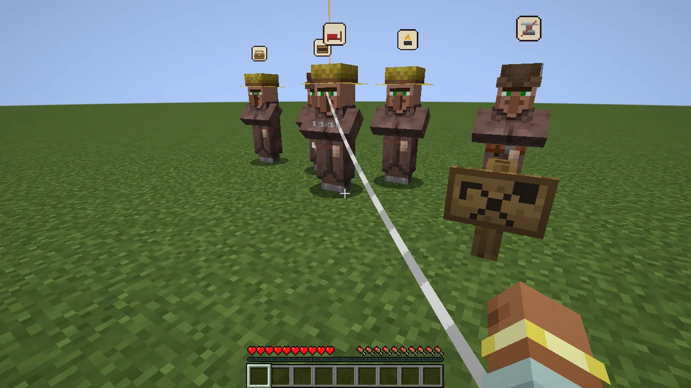

| What you do | What happens |
|---|---|
| Right-click an owned villager with the chain | It's in chains and you lead it. Anyone can do this, to move someone's worker. |
| Right-click a villager in chains that nobody holds | You take its chain. |
| Right-click one you're holding, as its owner | The chains come off and the chain comes back to you. |
| Right-click one you're holding, as anyone else | You let go. It stays in chains: only the owner takes them off. |
| Pull it more than ten blocks | The chain snaps out of your hand. It stays in chains, standing there. |
| Right-click a fence while leading | It's tied there, like any lead. |

An ordinary lead still does nothing to a villager.

## Captives

### Taking a captive

**Hold right-click with the chain lead on a free villager for two seconds**, within two
blocks, looking at it. It screams and stands still while you hold. Let go, step away or look
away, and it slips free. When the two seconds are up it's your **captive**, in chains, on
your chain.

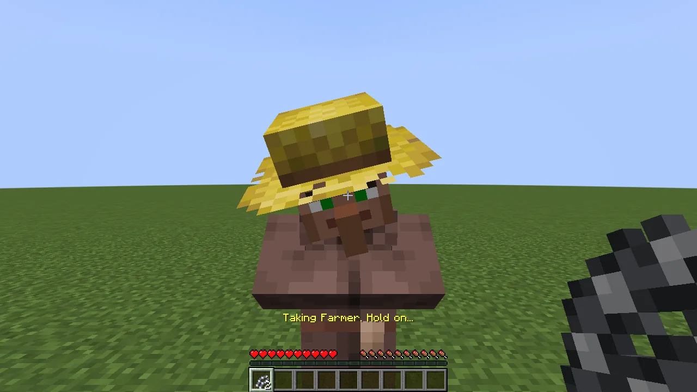

- Only a grown villager with a trade can be taken.
- Captives cost nothing, but taking one is **a heavy crime** where it stood:
  - nobody but the captive saw: nothing more;
  - other villagers saw: your reputation with each of them drops;
  - **a guard saw:** the guard comes to fine you. **Pay** (15 emeralds) and the guards free
    every villager you took in that case and keep the chains. **Leave** and you keep them.
  - outside a village's buildings it's no crime at all.
- In a village someone bought with Village Deed, only the owner and the players they trust can
  take its people, and for them it's no crime.

### Living as a captive

A captive takes a bed and a post like any worker, but:

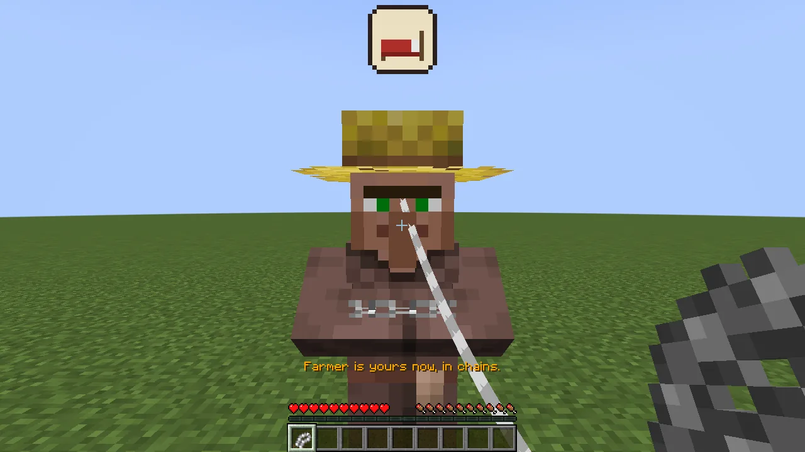

- It works **2000–10000**, through the hired workers' meeting, and stands about the rest of
  the day. Without a post it just stands about.
- It walks and works **10% slower**.
- It doesn't follow you, meet, chat, trade with other villagers or have children, and it never
  summons iron golems.
- At work it now and then **hums a slow work song**.
- It **never shops** and never gets the morning emeralds.
- **Escapes:** asleep in its bed at midnight, a captive has a 5% chance each night to get up
  and walk back toward the village it was taken from. Once inside, it's free. Put it back in
  chains on the way and the escape is over.

### In the trailer

Vanilla Wheels' trailer carries villagers in chains the way it carries animals:

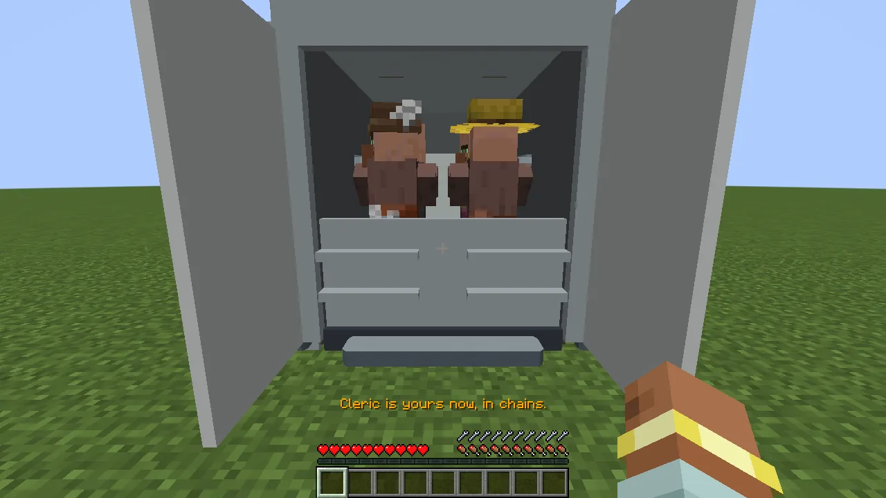

1. Open its doors (crouch and right-click a door).
2. **Right-click the trailer with an empty hand** (or a lead or a chain) while you lead
   villagers in chains. Up to four board, nearest first.
3. To let everyone out, crouch and right-click the open doors **with a lead or a chain** in
   hand. They step out behind, still in chains.

## What a worker wears

Dress any worker of yours (hired, captive, in chains, or a child) in the Worker Screen's four
slots: click a piece on, or shift-click it from your inventory.

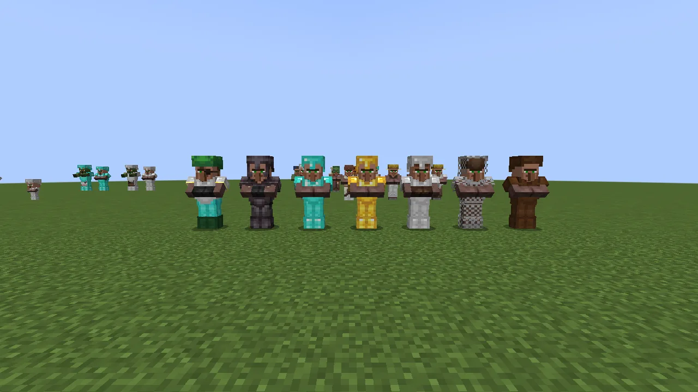

- **What fits:** anything you could wear there yourself: armour, a turtle shell, a carved
  pumpkin, a mob head, an elytra, and Lucky's Wardrobe's clothes.
- **Protection** works as on you, enchantments and all, and armour **wears out** as yours
  does. A worn-out piece breaks off. Workers never dress themselves.
- **Curse of Binding** keeps a piece on, as on you.
- **Only you**, the owner, can open the screen, within eight blocks.
- **How it looks:** anything on its legs takes the villager's robe off, so leggings and
  trousers show. Anything on its head hides its trade's hat.

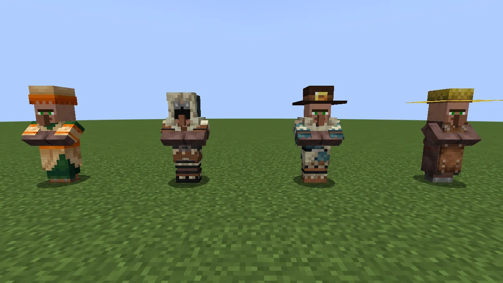

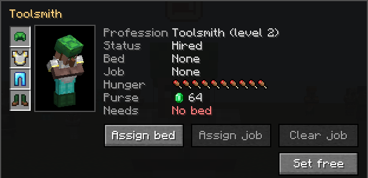

| When a worker stops being yours | What it was wearing |
|---|---|
| It dies, or turns into a zombie villager | Drops with its other things |
| You set it free | It takes everything off and drops it where it stands |
| It escapes, or the law frees it | It leaves wearing it: catch it again to get your gear back |

## Meals

Workers get hungry and eat breakfast and dinner. Children and free villagers don't.

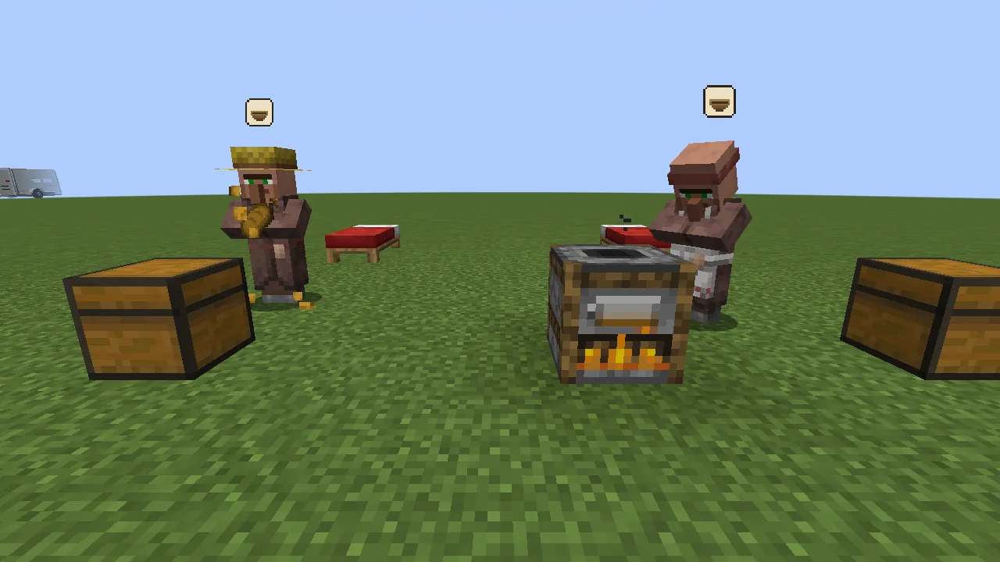

- **Hunger** runs from 20 down to 0, like yours: a point an hour awake, half asleep. Two meals
  a day keep a worker fed.
- **Below half** it works slower, down to half speed. **At 0** it stops working until it has
  eaten. Hunger never kills.
- It eats at **breakfast (0–2000)** and **dinner (10000–12000)**, and also breaks off work to
  eat whenever it drops below half.

**Where the food comes from**, the first that has some:

1. **Its home chest:** the chest (or barrel) nearest its bed, within 8 blocks.
2. **The canteen:** the chests of your Work Posts within 48 blocks of its bed. Your cook's
   kitchen feeds everyone.
3. **Cooking:** ingredients from its home chest, cooked at a free furnace, smoker, campfire,
   stove or pot near home, with fuel from the home chest.
4. **Raw food**, only when nothing near home can cook it.

It eats ready food (bread, cooked meat, carrots, Farmer's Delight's meals). It never eats
anything harmful (rotten flesh, raw chicken), and never golden apples or chorus fruit. Bowls go
back to its home chest.

With no food at home or in the canteen and an emerald in its purse, a worker walks to a
[stall](#the-market) within 64 blocks of its bed and **buys** food. Captives never buy.

## The market

### Purses

**Every villager has a purse** of up to 64 emeralds.

- **Trading with you:** a villager pays for what it buys from you out of its purse. A trade it
  can't afford shows **sold out** (the red cross). The emeralds you pay go into its purse.
- Villagers already in the world start full. One born, cured or spawned starts with 4.
- **Morning money:** each morning a villager with fewer than 4 gets 2.

### The For Sale block

A **For Sale block** (a sign over a chest over an emerald) is your stall. Villagers come and buy
from it.

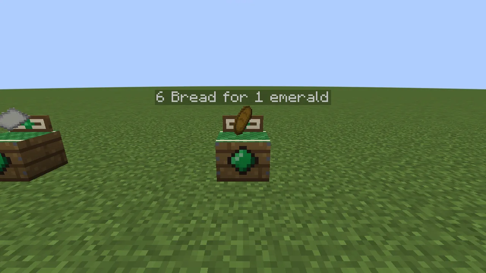

- **Stall tab:** click an item onto the top-left slot to sell it. Set how many make one sale
  and the price (1 to 64 each; shift for eight at a time). Its 18 stock slots take only that
  item; the 9 proceeds slots collect the emeralds.
- **Ledger tab:** each of the last seven days' sales and emeralds, the visits that came to
  nothing (too pricey, couldn't afford, not interested), and the latest visits.
- Look at it within eight blocks to read "6 Bread for 1 emerald", or "sold out".
- Hoppers and pipes fill its stock and take its emeralds.
- Only you can open or break it, and explosions leave it alone.

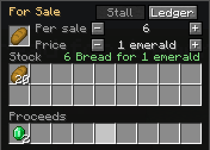

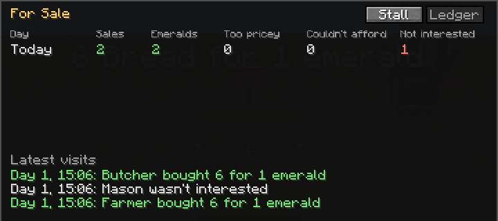

### Who shops, and for what

Free villagers shop from 9000 to 11000, hired workers in their meeting hours (8000–10000), up
to three sales a day while they hold an emerald. Captives, children and villagers in chains
never shop. A villager living in a village bought with Village Deed shops only at stalls of the
owner and the players they trust.

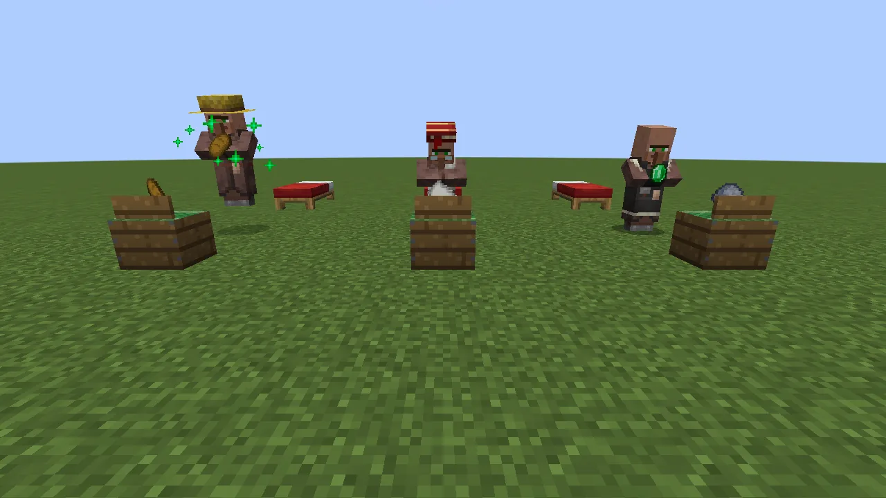

- **Needs:** every villager keeps a household. Food for everyone, and what its trade uses
  (a farmer's bone meal, a butcher's coal, a librarian's paper...). Whatever it runs short of,
  it goes to buy at the cheapest stall within 64 blocks of its bed.
- **A worker's needs:** food when home and the canteen run low, and whatever its post lacks
  (a tool, fuel, what its stock list is short of), paid from its own purse.
- **Taste:** every villager likes some kinds of goods more than others (food, tools, decor,
  luxury), leaning by trade. It wants up to three of things it likes, and pays more for them.
- **Climate:** goods from another climate (cactus and melons from hot lands, snow and ice from
  cold ones) are worth half again to a villager who lives elsewhere.
- **Window shopping:** with nothing it needs for sale in reach, it wanders from stall to stall
  and has a look.
- **What you'll see:** a bargain gets green sparkles and a "yes"; too pricey, a head shake;
  can't afford, it looks at an emerald in its hand; something from its favourite kind, it
  celebrates with a hop. Then it walks home carrying what it bought.

A town farmer also **sells its spare bread**, potatoes and carrots to other villagers. Your own
workers never sell your goods: what's in your posts' chests stays yours.

## Raids

A base with your villagers in their beds counts as a village to a raid. When a raid starts,
every grown villager you own (hired or captive, out of chains) **arms itself** from its home
chest and its post's chests:

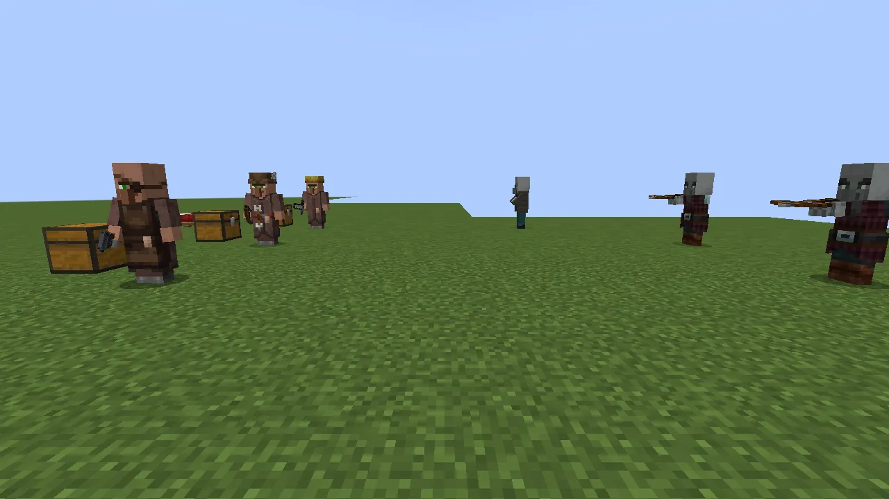

- **What it takes:** the best ranged weapon it has ammunition for (a gun, a crossbow or a
  bow) with up to 64 rounds or arrows, and its best melee weapon (sword, axe, mace, trident) as
  a backup. Ranged comes first: villagers are fragile.
- **Never a rocket launcher.** It would blow holes in your base.
- **Guns** reload from loose rounds only. Magazines stay in the chest.
- **Fighting:** it attacks raiders it can see within 32 blocks, never chasing more than 48
  blocks from its post or bed. It **holds fire** while you, a villager, a golem, a guard or a
  pet is in its line of fire.
- **Out of ammo**, it draws its melee weapon; with nothing to fight with, it hides like any
  villager. Free villagers always hide.
- **Afterwards** it puts every weapon and the leftover ammo back in the chest it came from.
  Armour stays on.

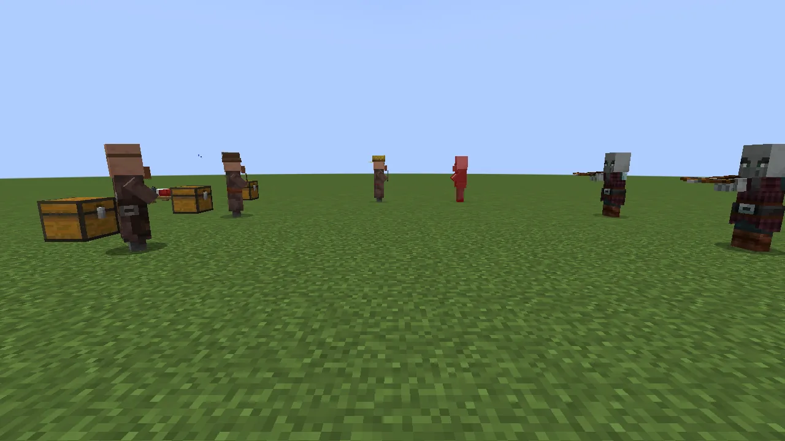

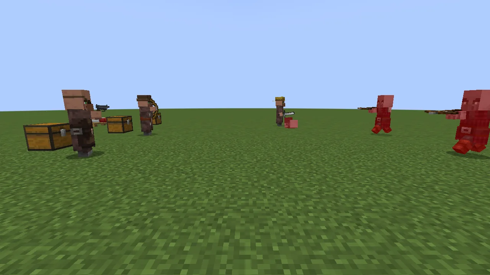

So: **keep weapons and ammunition in your workers' chests**, and they'll defend the base.

## Good to know

- **Children:** a child of two of your hired villagers is yours, hired, and keeps the bed it
  was born in. It can take a job once grown.
- **Golems:** hired workers summon iron golems like other villagers. Captives never do.
- **Death:** a worker that dies, or turns into a zombie villager, drops its tool, everything
  it carries and wears, and its chain. A cured one is a free villager.
- **Recipes:** point at an item and press **R** to see how it's made (EMI).
